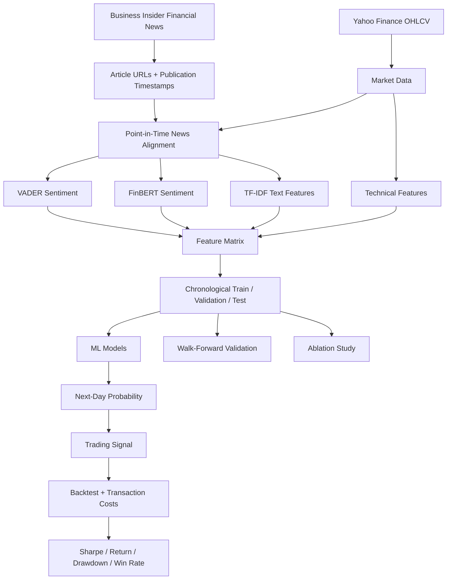

# 📈 News2Trade

### Financial News Sentiment → Next-Day Stock Direction → Trading Strategy

[](https://www.python.org/)
[](https://scikit-learn.org/)
[](https://huggingface.co/ProsusAI/finbert)
[](https://finance.yahoo.com/)

> **Can financial news provide useful information for predicting whether a stock will rise or fall on the next trading day?**

News2Trade is an end-to-end **NLP + Machine Learning + quantitative-finance** project that investigates this question. It collects financial news, aligns it with historical market data, extracts sentiment and textual features, adds technical indicators, trains leakage-controlled models, and evaluates the resulting signals through an out-of-sample trading backtest.

---

## 🧭 Quick Navigation

- [What does the project do?](#-what-does-the-project-do)
- [Architecture](#-architecture)
- [Research Methodology](#-research-methodology)
- [Feature Engineering](#-feature-engineering)
- [Models](#-models)
- [Evaluation](#-evaluation)
- [Ablation Study](#-ablation-study)
- [Project Structure](#-project-structure)
- [Run the Project](#-run-the-project)
- [Important Research Decisions](#-important-research-decisions)
- [Limitations](#-limitations)
- [Original vs Improved Version](#-original-vs-improved-version)
- [Future Improvements](#-future-improvements)

---

## 🔎 What does the project do?

At a high level:

```text
Financial News
     │
     ▼
Publication Timestamp Extraction
     │
     ▼
Point-in-Time Alignment ───────────────┐
     │                                 │
     ▼                                 ▼
VADER Sentiment                    FinBERT
     │                                 │
     └──────────────┬──────────────────┘
                    ▼
             Daily Sentiment
                    │
                    ├───────────────┐
                    ▼               ▼
                TF-IDF        Technical Indicators
                    │               │
                    └───────┬───────┘
                            ▼
                    ML Classification
                            │
                            ▼
                   P(Next Day Up)
                            │
                            ▼
                     Trading Signal
                            │
             ┌──────────────┴──────────────┐
             ▼                             ▼
       Strategy Return               Buy & Hold
             │                             │
             └──────────────┬──────────────┘
                            ▼
                 Financial Evaluation
```

The key idea is that **classification performance is not the final objective**. A model can have reasonable accuracy and still be a poor trading strategy. Therefore, the project evaluates both the ML predictions and their financial consequences.

---

## 🏗️ Architecture



### Core components

| Component | Purpose |
|---|---|
| **Business Insider** | Financial-news headlines and publication timestamps |
| **Yahoo Finance / yfinance** | Historical OHLCV market data |
| **VADER** | Fast rule-based financial/news sentiment baseline |
| **FinBERT** | Finance-domain transformer sentiment |
| **TF-IDF** | Sparse lexical representation of news |
| **Technical indicators** | Momentum, trend, volatility and volume signals |
| **scikit-learn** | Model training and evaluation |
| **Backtester** | Converts predictions into portfolio returns |

---

## 🧪 Research Methodology

The improved implementation is designed around one principle:

> **Never allow information from the future to influence a past prediction.**

### 1. Data collection

For a selected ticker such as `META`, the pipeline collects:

- Financial news headlines
- Absolute article publication timestamps
- Historical OHLCV prices

Relative labels such as `"2d"`, `"5h"`, etc. are **not used as the final timestamp source**. The scraper attempts to recover `datePublished` from the article's JSON-LD or metadata.

### 2. Point-in-time alignment

News is associated with its publication date and market observations are kept in chronological order.

This is important because using information that was published after the prediction point would create **look-ahead bias**.

### 3. Target construction

The prediction target is next-day return:

```text
target_return = Close[t+1] / Close[t] - 1
```

Then:

```text
1 → next trading day's return is positive
0 → next trading day's return is non-positive
```

### 4. Feature engineering

Three feature families are investigated:

```text
                 ┌── Technical Features
                 │
News ────────────┼── Sentiment Features
                 │
                 └── Text Features
```

### 5. Temporal split

The dataset is split chronologically:

```text
Past ─────────────────────────────────────────────── Future
│                    │               │
│      TRAIN         │  VALIDATION   │     TEST
│       70%          │      15%      │      15%
└────────────────────┴───────────────┴──────────────
```

There is **no random shuffling across time**.

### 6. Leakage-free TF-IDF

The TF-IDF vocabulary and IDF statistics are fitted only on the training period:

```text
TRAIN TEXT ──fit──> TF-IDF vocabulary
                         │
                         ├──transform──> VALIDATION
                         └──transform──> TEST
```

This prevents information from future documents from influencing the representation of the training data.

### 7. Model training

The project compares different information sources rather than relying on a single model.

### 8. Trading simulation

Predicted probabilities are converted into a simple long/cash strategy:

```text
P(up) >= 0.50  →  Long
P(up) <  0.50  →  Cash
```

A configurable transaction cost is charged whenever the position changes.

---

## 🧠 Feature Engineering

### Technical features

The improved pipeline includes:

- 1-day return
- 5-day return
- 20-day return
- 10/20/50-day SMA ratios
- RSI(14)
- MACD
- MACD signal
- 20-day volatility
- Volume change

These provide the model with information about **momentum, trend, volatility and market activity**.

### VADER features

Daily news is aggregated into:

- Number of articles
- Mean sentiment
- Maximum sentiment
- Minimum sentiment
- Sentiment standard deviation
- Positive-news ratio
- Negative-news ratio

### FinBERT features

`ProsusAI/finbert` is used to obtain finance-specific positive/negative sentiment probabilities. Daily aggregates are then constructed.

### TF-IDF features

News headlines are represented using:

- Unigrams + bigrams
- Maximum vocabulary size
- Minimum document frequency filtering
- Sublinear TF scaling

The vectorizer is always fitted only on the historical training window.

---

## 🤖 Models

### Numeric feature models

**HistGradientBoostingClassifier** is used for technical and sentiment features.

### Text model

**Logistic Regression** is used with sparse TF-IDF features because it is computationally efficient and well suited to high-dimensional sparse text representations.

### Combined model

The combined model fuses:

```text
TF-IDF
   +
Technical Indicators
   +
VADER
   +
FinBERT
   ↓
Logistic Regression
```

This lets us test whether combining textual and market information is more useful than either source alone.

---

## 📊 Evaluation

### Machine-learning metrics

- Accuracy
- Precision
- Recall
- F1-score

### Trading metrics

- Strategy return
- Buy-and-hold return
- Sharpe ratio
- Maximum drawdown
- Number of trades
- Win rate

The **buy-and-hold benchmark** is essential: beating a naive ML baseline is not enough if simply holding the stock performs better.

---

## 🔬 Ablation Study

One of the most important experiments is determining **which information actually helps**.

The pipeline compares:

| Experiment | Features |
|---|---|
| Technical Only | Technical indicators |
| Sentiment Only | VADER + FinBERT + news statistics |
| Technical + Sentiment | Technical + sentiment |
| TF-IDF Only | News text |
| Combined | TF-IDF + technical + sentiment |

This answers a more meaningful question than simply asking for the highest accuracy:

> **Does financial news add predictive information beyond historical market behavior?**

---

## 🔄 Walk-Forward Validation

A single train/test split can give a misleading picture for financial data.

Therefore the project also uses expanding-window evaluation:

```text
Fold 1: ████████████ → ██
Fold 2: ██████████████ → ██
Fold 3: ████████████████ → ██
Fold 4: ██████████████████ → ██

        Train          Future Test
```

Each fold trains only on observations available before that fold's test period.

This provides a more realistic estimate of how the strategy behaves as market conditions change.

---

## 💰 Backtesting

The backtester converts predictions into portfolio returns.

For each test day:

1. Generate `P(up)`.
2. Convert probability into a long/cash signal.
3. Apply the next trading day's return.
4. Deduct transaction costs when the position changes.
5. Track portfolio equity.
6. Compare against buy-and-hold.

The result is evaluated using both **return and risk-adjusted performance**.

---

## 📁 Project Structure

```text
SentimentAnalysis/
│
├── Ishan_openproject_2-2.ipynb     # Original exploratory implementation
│
├── research_pipeline.py            # Improved research pipeline
│
├── requirements_improved.txt       # Dependencies for improved pipeline
│
├── README.md                       # Project documentation
│
└── LICENSE
```

The original notebook is intentionally preserved so the evolution from the initial implementation to the leakage-controlled research version is visible.

---

## 🚀 Run the Project

### 1. Clone

```bash
git clone https://github.com/ish4722/SentimentAnalysis.git
cd SentimentAnalysis
```

### 2. Install dependencies

```bash
pip install -r requirements_improved.txt
```

### 3. Run for META

```bash
python research_pipeline.py --ticker META --pages 100
```

You can change the ticker:

```bash
python research_pipeline.py --ticker AMZN --pages 100
```

### What happens on the first run?

The pipeline may download the FinBERT model from Hugging Face. This can take some time and requires internet access.

The news scraper may also take time because article pages are inspected individually to recover absolute publication timestamps.

---

## ⚠️ Important Research Caveats

This is an **experimental research project**, not financial advice or a production trading system.

### News source

The current scraper depends on Business Insider's HTML structure. Websites can change their markup, rate-limit requests, or restrict automated access. A production system should use a licensed news API with reliable timestamps.

### Financial data

yfinance is convenient for research but should not be treated as a guaranteed production-grade market-data feed.

### Performance claims

The project deliberately does **not** hard-code impressive accuracy or return numbers into the README. Results should be generated from the current data run and interpreted out-of-sample.

### Market regime changes

A model that works in one period may fail in another. This is why walk-forward validation and benchmark comparison are included.

---

## 🆚 Original vs Improved

| Area | Original | Improved |
|---|---|---|
| Data split | Basic 70/30 | Chronological 70/15/15 |
| TF-IDF | Fit before split | Fit only on historical data |
| News dates | Relative date conversion | Article publication timestamps |
| Text sentiment | TextBlob + VADER | VADER + FinBERT |
| Market features | Basic OHLCV | Momentum + RSI + MACD + volatility + volume |
| Validation | Single split | Walk-forward + holdout test |
| Trading | Basic simulation | Transaction costs + benchmark |
| Financial metrics | Limited | Return + Sharpe + drawdown + win rate |
| Experiments | Single/best model | Ablation across feature families |
| Documentation | Method description | Architecture + methodology + reproducible workflow |

---

## 🛠️ Future Improvements

Potential next steps:

- Replace web scraping with a licensed real-time financial-news API
- Use market-session-aware timestamps for more precise trade timing
- Add transaction-cost/slippage models based on liquidity
- Optimize the decision threshold using the validation period
- Add XGBoost/LightGBM comparison
- Add portfolio-level multi-stock experiments
- Add confidence-based position sizing
- Add statistical significance tests
- Add equity-curve and drawdown plots
- Add experiment tracking and reproducible result artifacts

---

## 👤 Author

**Ishan Tandon**

Built as an exploration of **NLP, machine learning, financial data and quantitative strategy evaluation**.

---

## 📜 Disclaimer

This repository is for educational and research purposes only. Nothing here constitutes financial advice, investment advice, or a recommendation to buy or sell any security.
